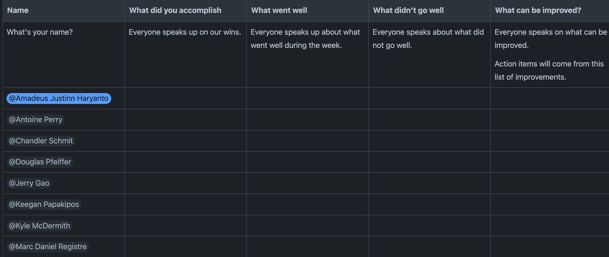

# weekly-retrospective-confluence
A script to create a new Weekly Retrospective page every Friday.

## How the Weekly Retrospective works
Every Friday, the GMA team runs through each member's thoughts regarding the concluding week, namely:
- what they accomplished,
- what they feel did or did not go well, and
- what they feel can be improved.

These thoughts are written in a table contained in a dedicated Confluence page that is created every Friday.

Template of table (from https://codagami.atlassian.net/wiki/spaces/COPS/pages/2484436997/GMA+Weekly+Retrospective):


## What this script does
This script copies the template from the template page, creates a new page with the date of the nearest future Friday in the title, then puts the contents into the copy. If the page already exists, no copying is done, since the page may already be filled and that content would be overwritten.

For example, if the script were run on 2024-06-13 (Thursday) and the page did not already exist, a new page with the title ["2024-06-14 Weekly Retrospective"](https://codagami.atlassian.net/wiki/spaces/COPS/pages/2571075590/2024-06-14+Weekly+Retrospective) would be created with [the template page](https://codagami.atlassian.net/wiki/spaces/COPS/pages/2484436997/GMA+Weekly+Retrospective) as its parent, and the template would be pasted therein.

## Running locally
These steps work after you have installed [Git](https://git-scm.com/book/en/v2/Getting-Started-Installing-Git) and [Python](https://www.python.org/downloads/).

1. Make a local copy of this repository. There are 2 ways you can do that:
    - Clicking the green button labelled `❬❭ Code ⏷`, then `Download ZIP`
    - Running `git clone https://github.com/Amadeus-Codagami/weekly-retrospective-confluence.git` from the terminal

2. Install the required packages in the repository's directory by running `cd <path/to/repository> && python -m pip install -r requirements.txt`.

3. If you have not created one, go to [the Atlassian tokens page](https://id.atlassian.com/manage-profile/security/api-tokens) and create an API token. This will be used to authenticate the script.

<figure>
    
    <figcaption>Click the blue Create API Token button at the top right.</figcaption>
</figure>
<br>
<figure>
    
    <figcaption>Give it any label you like. Then hit Create.</figcaption>
</figure>

> **NOTE**: Please copy your token and save it in an easily accessible file after it is generated. **You will not be able to access it from the page again after dismissing the modal.**

<figure>
    
    <figcaption>Life is fleeting, and so is the modal with your new token. Copy it and save it elsewhere!</figcaption>
</figure>

4. Back in the repository's root directory, create a file named `.env`.
    1. In this file, write your Codagami email address in the format `<key for email>="<email address>"` (e.g. `KEY_USERNAME="first.last@codagami.com"`).
    2. In a new line, write the API token you generated in step 3 in the format `<key for token>="<token>"` (e.g. `KEY_TOKEN="ABCD"`).<br>
    At this point, the `.env` file should look something like this:
    ```
    KEY_USERNAME="first.last@codagami.com"
    KEY_TOKEN="ABCD"
    ```
    The keys can be given any name.

5. Open `weekly_retrospective_confluence.py`. Replace `KEY_USERNAME` in line 10 with the key you used in step 4(i) (`<key for email>`), and replace `KEY_TOKEN` in line 11 with the key you used in step 4(ii) (`<key for token>`). **Make sure both keys are surrounded by quotes.**
```python
USERNAME_LOCAL = ENV.get("KEY_USERNAME", "<No .env username>")
TOKEN_LOCAL = ENV.get("KEY_TOKEN", "<No .env token>")
```

6. Run the script with `python weekly_retrospective_confluence.py`.
    - If it *did not* exist before running the script, the new Weekly Retrospective page with the correct title should appear under [its parent](https://codagami.atlassian.net/wiki/spaces/COPS/pages/2484436997/GMA+Weekly+Retrospective). You should also see output in the terminal that looks something like this:
    ```
    >>> python weekly_retrospective_confluence.py
    11:36:55.396780: ✅ Succeeded in creating "2024-06-14 Weekly Retrospective".
    Check it out at https://codagami.atlassian.net/wiki/spaces/COPS/pages/2571075590/2024-06-14+Weekly+Retrospective
    ```
    - If it *did* exist before running the script, the Weekly Retrospective page will not be created, and you should see output in the terminal that looks something like this:
    ```
    >>> python weekly_retrospective_confluence.py
    Weekly Retrospective page with that date already exists at https://codagami.atlassian.net/wiki/spaces/COPS/pages/2571075590/2024-06-14+Weekly+Retrospective, and it may be filled. Halting.
    ```

## The GitHub Action
[The GitHub Action](https://github.com/Amadeus-Codagami/weekly-retrospective-confluence/blob/main/.github/workflows/main.yml) is scheduled to automatically run every Friday at 14:00 GMT (Friday, 09:00 CDT; Friday, 08:00 CST).
